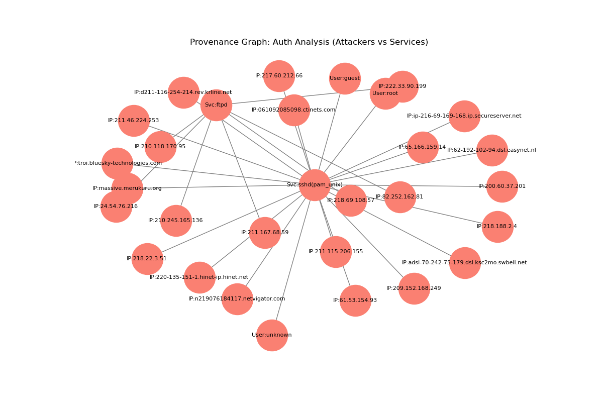

# Log Provenance Visualizer

這是一個將 Linux 系統日誌（Auth Log）轉換為 **Provenance Graph (溯源圖)** 的工具。
它可以幫助安全分析人員識別暴力破解攻擊（Brute-force）以及系統服務間的因果關係。

## 功能
- 解析 SSH/FTP 登入失敗事件。
- 提取攻擊者 IP、受攻擊服務與目標使用者。
- 使用 NetworkX 繪製多層級溯源圖，並依據事件頻率調整連線粗細。

## 安裝與執行
1. 安裝套件：`pip install -r requirements.txt`
2. 將 Log 放入 `data/` 資料夾。
3. 執行：`python src/visualizer.py`

## 資料集
loghub: https://github.com/logpai/loghub/blob/master/Linux/Linux_2k.log

## 執行成果

